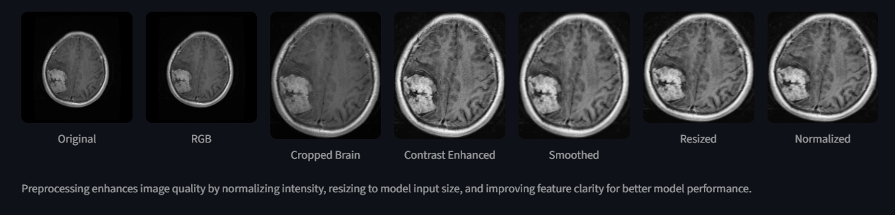

# 🧠 Explainable Deep Learning Model For Brain Tumor Detetction using MRI Images.

## 📌 Overview

This project focuses on the **detection and classification of brain tumors** from MRI images using a **Convolutional Neural Network (CNN)**.
It also integrates **Explainable AI (XAI)** using **Grad-CAM** to visualize model decision-making.

The system classifies MRI images into multiple tumor categories and provides visual explanations highlighting important regions influencing predictions.

---

## 🎯 Objectives

* Detect brain tumors from MRI images
* Perform **multiclass classification**
* Improve model interpretability using **Grad-CAM**
* Build a structured deep learning pipeline

---

## 🧠 Model Architecture

* Convolutional Neural Network (CNN)
* Layers:

  * Convolution + ReLU
  * Max Pooling
  * Fully Connected Layers
  * Softmax Output (Multiclass)

---

## 📊 Dataset

* Brain MRI Images Dataset
* Contains multiple categories of brain tumors
* Organized into:

  * Training set
  * Testing set

---

## ⚙️ Tech Stack

* Python
* TensorFlow / Keras
* NumPy
* OpenCV
* Matplotlib
* VS Code

---

## 📂 Project Structure

```
BRAIN_TUMOR_DETECTION_BE_PROJECT/
│
├── V2_Multiclass/
│   ├── dataset/
│   │   ├── Training/
│   │   └── Testing/
│   │
│   ├── models/
│   │   └── multiclass_brain_tumor_cnn.h5
│   │
│   ├── notebooks/
│   │   ├── 01_dataset_verification.ipynb
│   │   ├── 02_data_loading.ipynb
│   │   ├── 03_multiclass_cnn_architecture.ipynb
│   │   └── 04_multiclass_gradcam.ipynb
│   │
│   ├── utils/
│
├── assets/
│   ├── Grad_CAM_Output.png
│   ├── class_distribution.png
│   ├── confusion_matrix.png
│   ├── preprocessing.png
|
├── requirements.txt
├── README.md
└── .gitignore
```

---

## 🧪 Workflow

1. **Dataset Verification**

   * Validate dataset integrity and class distribution

2. **Data Loading & Preprocessing**

   * Image resizing
   * Normalization
   * Label encoding

3. **Model Training**

   * CNN training on MRI dataset
   * Performance evaluation

4. **Explainability (Grad-CAM)**

   * Visualize important regions in MRI images
   * Interpret model predictions

---

## 📥 Pre-trained Model

Due to GitHub file size limitations, the trained model is not included in this repository.

👉 Download model from here:
**[https://drive.google.com/drive/folders/1J6zwcEmjOlWpcxnOJCGMR1g0edaYCM2G?usp=sharing]**

After downloading, place it in:

```
V2_Multiclass/models/multiclass_brain_tumor_cnn.h5
```

---

## ▶️ How to Run

### 1. Clone Repository

```bash
git clone https://github.com/TanmayT134/Explainable-Brain-Tumor-Detection.git
cd Explainable-Brain-Tumor-Detection
```

---

### 2. Create Virtual Environment

```bash
python -m venv venv
```

---

### 3. Activate Virtual Environment

#### Windows:

```bash
venv\Scripts\activate
```

#### Mac/Linux:

```bash
source venv/bin/activate
```

---

### 4. Install Dependencies

```bash
pip install -r requirements.txt
```

---

### 5. Set Up Python Kernel (Important)

```bash
pip install ipykernel
python -m ipykernel install --user --name=venv
```

Then in VS Code:

* Open notebook
* Select kernel → **venv**

---

### 6. Download Pre-trained Model

Download from:
👉 [Download Model](https://drive.google.com/drive/folders/1J6zwcEmjOlWpcxnOJCGMR1g0edaYCM2G?usp=sharing)

Place it in:

```
V2_Multiclass/models/multiclass_brain_tumor_cnn.h5
```

---

### 7. Run Notebooks (in order)

* 01_dataset_verification.ipynb
* 02_data_loading.ipynb
* 03_multiclass_cnn_architecture.ipynb
* 04_multiclass_gradcam.ipynb


---

## 📈 Results

* Successful classification of brain tumor types
* Grad-CAM visualizations highlight tumor regions
* Improved trust and interpretability of the model

---

## 📊 Visual Results

### 📈 Dataset Insights

#### Class Distribution


* Shows the distribution of different tumor classes
* Helps identify dataset balance or imbalance

---

### ⚙️ Data Preprocessing

#### Preprocessing Steps



* Image resizing and normalization
* Preparation of MRI scans for CNN input

---

### 📊 Model Evaluation

#### Confusion Matrix


* Displays model performance across all classes
* Helps analyze misclassifications

---

### 🔥 Explainable AI (Grad-CAM)

#### Grad-CAM Output (Exmaple : No Tumor Found Image)


#### Grad-CAM Output (Exmaple : Tumor Found Image)


* Highlights important regions in MRI images
* Shows where the model is focusing
* Improves interpretability and trust

---

## 📌 Key Observations

* Model performs well across multiple tumor classes
* Confusion matrix indicates classification accuracy and errors
* Grad-CAM correctly highlights tumor regions
* Preprocessing improves model performance and consistency

---

## 📌 Applications

* Medical imaging analysis
* Computer-aided diagnosis
* AI-assisted healthcare systems

---

## 👨‍💻 Contributors

* **Tanmay Tawade**

  * CNN model development, training, and optimization
  * Grad-CAM (Explainable AI) implementation
  * Code integration and GitHub setup

* **Aishwarya Kale**

  * Dataset collection and organization
  * Data preprocessing
  * Project poster, logbook, PPT presentation and report content

* **Sakshi Bedekar**

  * Initial project idea and concept discussion
  * Testing and result analysis
  * Documentation, Project Poster, PPT presentation and report content

> 📌 *Note: The project approach, design decisions, and improvements were discussed and finalized collaboratively by all team members.*

---

## ⭐ Acknowledgements

* Kaggle Dataset
* Open-source deep learning libraries
* Research papers on CNN & Explainable AI

---
