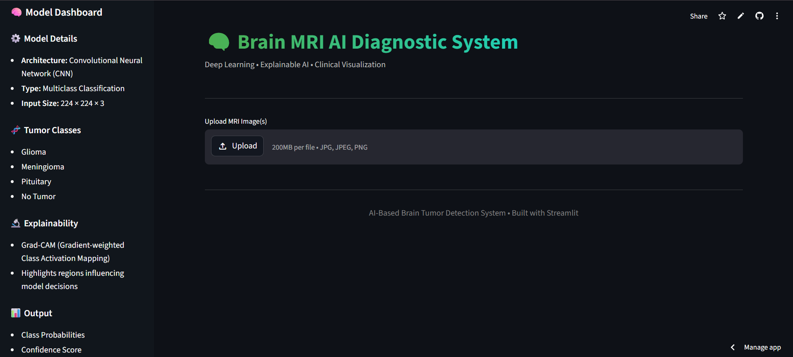
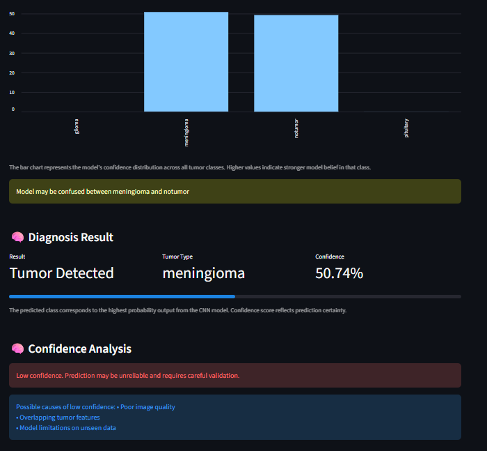
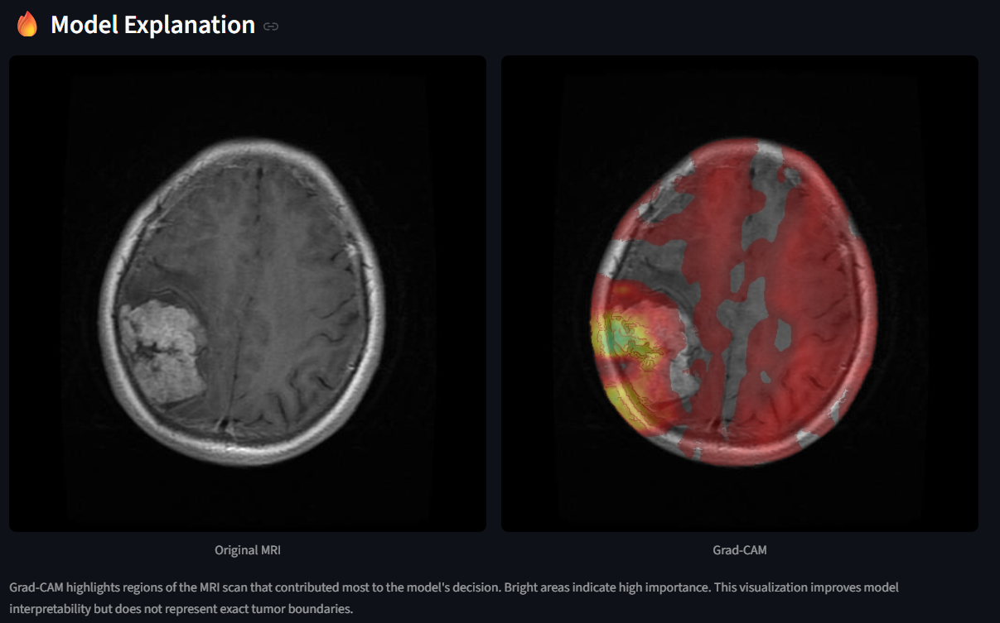
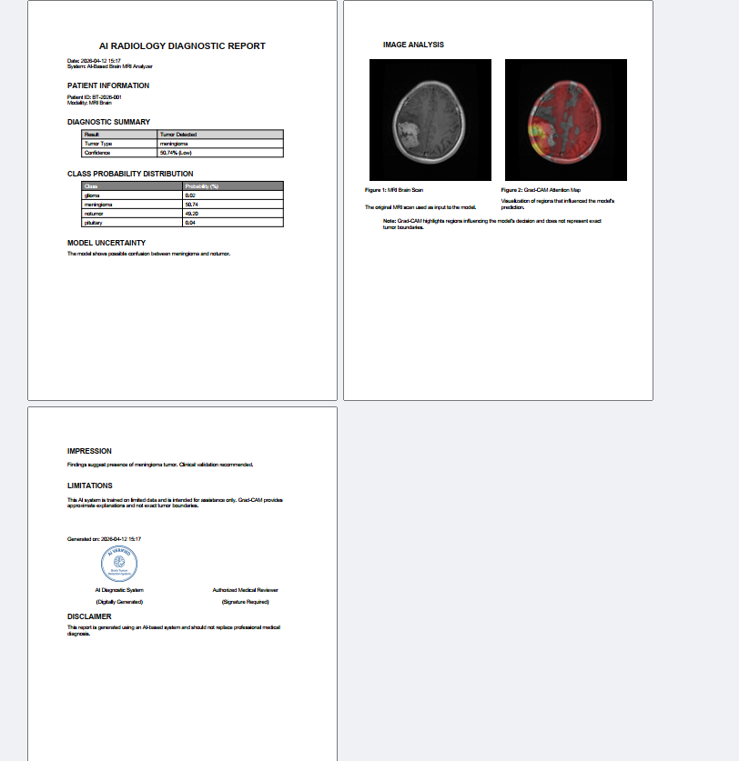

# 🧠 Explainable Deep Learning Model For Brain Tumor Detection and Classification using MRI Images

---

## 🚀 Live Demo

👉 **Try the Application:**  
🔗 https://brain-mri-ai.streamlit.app/

---

## 📌 Overview

This project presents an **AI-powered diagnostic system** that detects and classifies brain tumors from MRI scans using a **Convolutional Neural Network (CNN)**.

Unlike traditional models, this system integrates **Explainable AI (XAI)** using **Grad-CAM**, allowing users to visually understand *why* the model made a prediction.

It is deployed as an **interactive web application** built with Streamlit.

---

## ✨ Features

- 🧠 Brain tumor classification from MRI images  
- 📊 Multiclass prediction (4 tumor categories)  
- 🔥 Grad-CAM visualization for explainability  
- 📈 Confidence score & probability distribution  
- ⚠️ Uncertainty detection  
- 🔍 Image quality assessment  
- 📄 Clinical-style PDF report generation  
- 🌐 Fully deployed web application  

---

## 🧬 Tumor Classes

| Class | Description |
|------|------------|
| Glioma | Tumor in brain/glial cells |
| Meningioma | Tumor in brain membranes |
| Pituitary | Tumor in pituitary gland |
| No Tumor | Normal brain MRI |

---

## 🧠 Model Architecture

- Convolutional Neural Network (CNN)
- Key Layers:
  - Convolution + ReLU  
  - Max Pooling  
  - Fully Connected Layers  
  - Softmax Output  

---

## 🔬 Explainable AI (Grad-CAM)

Grad-CAM provides **visual explanations** by highlighting regions in the MRI scan that influenced the model’s decision.

> ⚠️ *Note:* Grad-CAM shows model attention, not exact tumor boundaries.

---

## ⚙️ Tech Stack

| Category | Tools |
|--------|------|
| Language | Python |
| Deep Learning | TensorFlow / Keras |
| Image Processing | OpenCV |
| Data Handling | NumPy, Pandas |
| Visualization | Matplotlib |
| Web App | Streamlit |
| Report Generation | ReportLab |

---

## 🗂️ Project Structure

```bash
BrainTumorSystem/
├── model/
│   └── model_loader.py
├── utils/
│   ├── preprocess.py
│   ├── gradcam.py
│   └── report.py
├── assets/
│   └── ai_stamp.png
├── app.py
├── requirements.txt
└── README.md
```

---

## 🔄 System Workflow

1. Upload MRI Image  
2. Image Quality Assessment  
3. Preprocessing (resize + normalization)  
4. Model Prediction  
5. Probability Distribution  
6. Confidence Analysis  
7. Grad-CAM Visualization  
8. Clinical Interpretation  
9. Report Generation  

---

## 📊 Outputs

- Tumor classification result  
- Confidence score  
- Probability distribution chart  
- Grad-CAM heatmap  
- Clinical interpretation  
- Downloadable PDF report  

---

## 📥 Model Download

Due to GitHub limitations, the trained model is not included.

👉 Download from:  
https://drive.google.com/drive/folders/1J6zwcEmjOlWpcxnOJCGMR1g0edaYCM2G?usp=sharing

Place it inside:

model/

---

## ▶️ Run Locally

### 1. Clone Repository
```bash
git clone https://github.com/TanmayT134/Explainable-Brain-Tumor-Detection.git
cd Explainable-Brain-Tumor-Detection
```

### 2. Create Virtual Environment

python -m venv venv

### 3. Activate Environment

#### Windows

venv\Scripts\activate

#### Mac/Linux

source venv/bin/activate

### 4. Install Dependencies

pip install -r requirements.txt

### 5. Run App

streamlit run app.py

---

## 📈 Results

Accurate classification across tumor classes

Grad-CAM highlights meaningful regions

Provides explainable predictions

Generates structured diagnostic reports

---

## 📸 Application Preview

### 🖥️ User Interface


---

### 📊 Prediction Output


---

### 🔥 Grad-CAM Visualization


---

### 📄 Generated Report


---

### 🧪 Preprocessing Steps


---

## ⚠️ Limitations

Trained on limited dataset

Not intended for clinical use

Grad-CAM provides approximate explanations

---

## 🎯 Applications

AI-assisted medical imaging

Educational tool for medical AI

Explainable AI research

Computer-aided diagnosis

--- 

## 👨‍💻 Team & Contributions

This project was developed collaboratively, with all members contributing across design, development, and evaluation phases.

---

### 📊 Aishwarya Kale
- Dataset collection, preprocessing, and organization  
- Data validation and preparation for model training  
- Contribution to system workflow design and documentation  
- Assistance in report structuring and result interpretation  

---

### 🧠 Tanmay Tawade
- CNN model integration and system architecture design  
- Grad-CAM implementation for explainable AI  
- Streamlit application development and UI/UX design  
- Integration of prediction, visualization, and report generation  

---

### 🧪 Sakshi Bedekar
- Project ideation and conceptual planning  
- Model testing, validation, and performance analysis  
- Contribution to evaluation of results and system behavior  
- Documentation, presentation, and reporting support  

---

> 📌 *All members actively contributed to discussions, design decisions, testing, and refinement of the system.*

---

## ⭐ Acknowledgements

Kaggle Brain MRI Dataset

TensorFlow & Keras

Streamlit

Research papers on CNN & XAI
