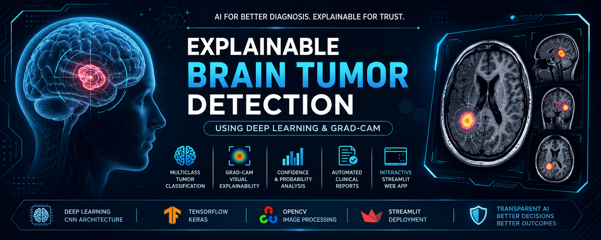
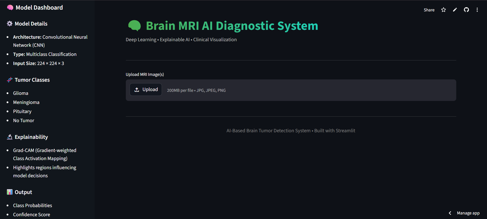
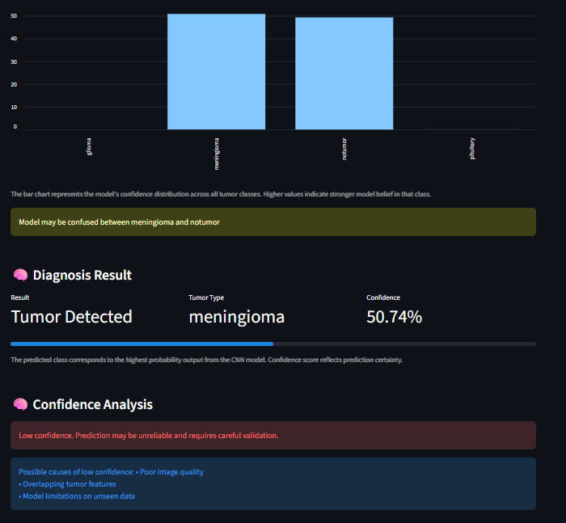
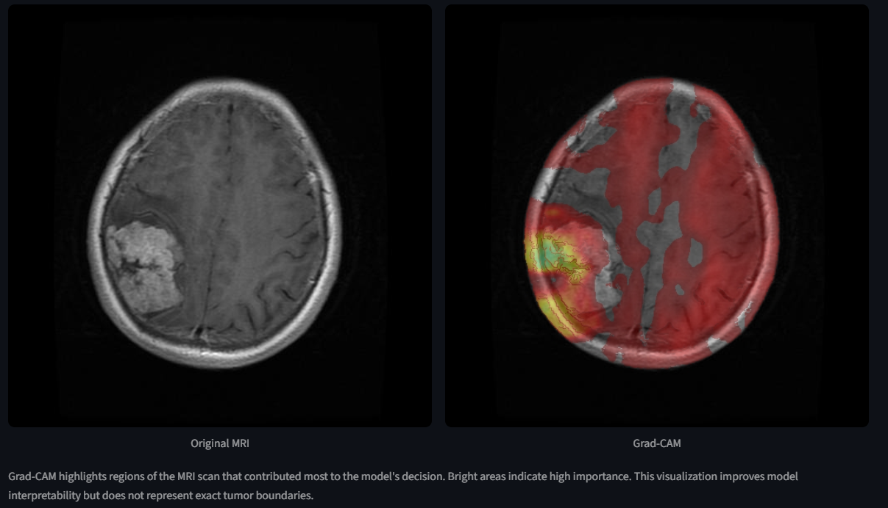
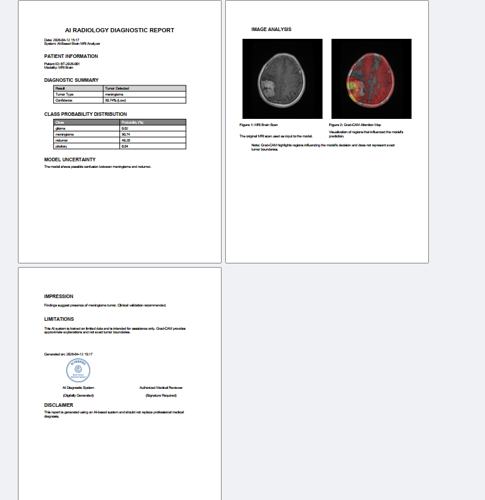
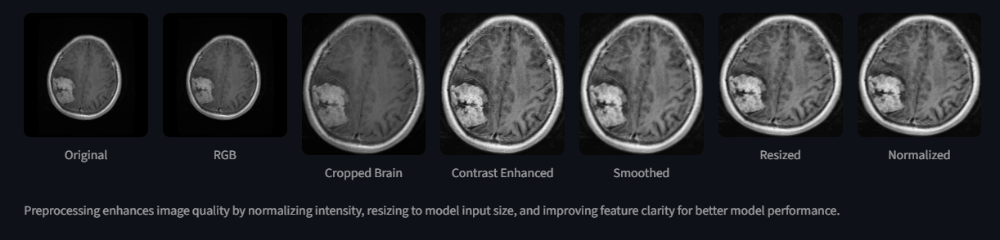

<p align="center">
  
</p>

<h1 align="center">🧠 Explainable Brain Tumor Detection using Deep Learning</h1>

<p align="center">
An AI-powered medical imaging system that automatically detects and classifies brain tumors from MRI scans using a <b>Convolutional Neural Network (CNN)</b> integrated with <b>Explainable Artificial Intelligence (Grad-CAM)</b>. The application combines deep learning with visual interpretability to provide transparent predictions, confidence analysis, probability visualization, and downloadable clinical-style reports through an interactive Streamlit web application.
</p>

<p align="center">


</p>

<p align="center">


</p>

---

# 🌐 Live Demo

### 🚀 Experience the Application

**https://brain-mri-ai.streamlit.app/**

---

# 🧠 Project Overview

Brain tumor diagnosis is a critical task in medical imaging where timely and accurate interpretation of MRI scans plays a significant role in clinical decision-making. Deep learning has demonstrated remarkable performance in medical image analysis; however, most models function as **black boxes**, making it difficult to understand the reasoning behind their predictions.

This project presents an **Explainable Artificial Intelligence (XAI)** framework for multiclass brain tumor detection and classification using **Convolutional Neural Networks (CNNs)**. To improve transparency and interpretability, the model integrates **Gradient-weighted Class Activation Mapping (Grad-CAM)**, enabling visualization of the image regions that contribute most to the model's predictions.

The application is deployed as an interactive **Streamlit** web application where users can upload MRI scans, receive real-time predictions, analyze confidence scores and probability distributions, visualize Grad-CAM heatmaps, and generate downloadable clinical-style PDF reports.

The project demonstrates the integration of **medical image preprocessing**, **deep learning**, **computer vision**, **Explainable AI**, and **interactive deployment** into a unified diagnostic support system.

> **Disclaimer:** This project is developed solely for educational and research purposes. It is not intended to replace professional medical diagnosis or clinical decision-making.

---

# 🚀 Key Features

### 🧠 Deep Learning-Based Classification

- Automatic Brain Tumor Detection
- Four-Class MRI Classification
- CNN-Based Prediction Engine
- Softmax Probability Distribution

---

### 🔥 Explainable Artificial Intelligence

- Grad-CAM Heatmap Generation
- Visual Interpretation of Model Decisions
- Explainable Predictions
- Improved Model Transparency

---

### 📊 Intelligent Prediction Analysis

- Prediction Confidence Score
- Class Probability Distribution
- Uncertainty Detection
- Clinical Interpretation

---

### 📄 Automated Medical Reporting

- Clinical-Style PDF Report Generation
- Prediction Summary
- Embedded Grad-CAM Visualization
- AI Verification Stamp

---

### 🌐 Interactive Web Application

- Streamlit-Based User Interface
- Drag-and-Drop MRI Upload
- Real-Time Prediction
- Responsive and User-Friendly Experience

---

# 🧬 Supported Classification Categories

| Tumor Type | Description |
|------------|-------------|
| 🟣 Glioma | Tumors originating from glial cells within the brain and spinal cord. |
| 🔵 Meningioma | Tumors developing from the meninges, the protective membranes surrounding the brain and spinal cord. |
| 🟠 Pituitary | Tumors affecting the pituitary gland located at the base of the brain. |
| 🟢 No Tumor | MRI scans without detectable tumor abnormalities. |

---

# 🛠 Technology Stack

| Category | Technologies |
|----------|--------------|
| Programming Language | Python |
| Deep Learning | TensorFlow, Keras |
| Computer Vision | OpenCV |
| Data Processing | NumPy, Pandas |
| Data Visualization | Matplotlib |
| Explainable AI | Grad-CAM |
| Web Framework | Streamlit |
| Report Generation | ReportLab |
| Development Environment | Jupyter Notebook, VS Code |

---

# 🗂 Dataset Overview

The model is trained on a publicly available **Brain MRI Dataset** containing four different categories of brain MRI images.

### Dataset Classes

| Class | Description |
|--------|-------------|
| Glioma | Brain tumors originating from glial cells |
| Meningioma | Tumors affecting the protective membranes of the brain |
| Pituitary | Tumors occurring in the pituitary gland |
| No Tumor | Healthy brain MRI images without tumor abnormalities |

The dataset was divided into **training** and **testing** subsets to evaluate the model's generalization capability while maintaining balanced class representation.

---

# 🧪 Image Preprocessing Pipeline

Medical images require preprocessing before being used for deep learning to improve consistency and model performance.

The preprocessing pipeline includes:

- RGB Image Conversion
- Brain Region Extraction
- Contrast Enhancement
- Gaussian Noise Reduction
- Image Resizing (224 × 224)
- Pixel Normalization

These preprocessing steps improve feature extraction while reducing noise and variations present in MRI scans.

---

# 🧠 CNN Model Architecture

The classification model is built using a custom **Convolutional Neural Network (CNN)** designed for multiclass brain tumor classification.

### Model Components

- Convolutional Layers
- ReLU Activation
- Max Pooling Layers
- Dropout Regularization
- Fully Connected Dense Layers
- Softmax Output Layer

The network progressively extracts low-level and high-level image features before classifying MRI scans into one of the four supported tumor categories.

---

# 🔥 Explainable Artificial Intelligence (Grad-CAM)

Traditional deep learning models often behave as **black-box systems**, making it difficult to understand how predictions are generated.

To improve transparency, this project integrates **Gradient-weighted Class Activation Mapping (Grad-CAM)**.

Grad-CAM produces visual heatmaps that highlight the regions of an MRI scan contributing most to the model's prediction, enabling users to better understand the reasoning behind the classification.

### Benefits of Explainability

- Improved model transparency
- Better prediction interpretability
- Increased user confidence
- Educational visualization for AI-assisted diagnosis

> **Note:** Grad-CAM highlights influential image regions and should not be interpreted as an exact tumor segmentation method.

---

# ⚙ System Workflow

```text
                MRI Brain Image
                       │
                       ▼
              Image Preprocessing
                       │
                       ▼
              CNN Classification
                       │
                       ▼
            Probability Distribution
                       │
                       ▼
             Confidence Analysis
                       │
                       ▼
           Grad-CAM Heatmap Generation
                       │
                       ▼
            Clinical Interpretation
                       │
                       ▼
            Downloadable PDF Report
```

---

# 📂 Project Structure

```text
Explainable-Brain-Tumor-Detection
│
├── assets
│   ├── banner
│   │   └── banner.png
│   │
│   ├── icons
│   │   └── ai_stamp.png
│   │
│   └── screenshots
│       ├── ui_main.png
│       ├── prediction_output.png
│       ├── gradcam_output.png
│       ├── preprocessing.png
│       └── report_output.png
│
├── dataset
│   ├── Training
│   └── Testing
│
├── docs
│   ├── Project_Report.pdf
│   └── Research_Paper.pdf
│
├── model
│   ├── model_loader.py
│   └── multiclass_brain_tumor_cnn.h5
│
├── utils
│   ├── gradcam.py
│   ├── preprocess.py
│   └── report.py
│
├── app.py
├── requirements.txt
├── README.md
└── .gitignore
```

---

# 🎯 Core Functionalities

- Brain MRI Classification
- Image Quality Assessment
- MRI Image Preprocessing
- CNN-Based Prediction
- Confidence Analysis
- Probability Visualization
- Grad-CAM Explainability
- Clinical Interpretation
- PDF Report Generation
- Interactive Streamlit Interface

---

# 📊 Model Performance

The developed CNN model demonstrates strong performance in multiclass brain tumor classification while maintaining prediction transparency through Explainable AI.

### Evaluation Metrics

- Overall Classification Accuracy: **~91%**
- Precision, Recall, and F1-Score Evaluation
- Confusion Matrix Analysis
- Softmax Probability Distribution
- Grad-CAM Visual Validation

The combination of quantitative metrics and visual explanations enables a more interpretable AI-assisted diagnostic workflow.

---

# 📸 Application Screenshots

## 🖥️ Home Interface

<p align="center">

</p>

---

## 📊 Prediction Output

<p align="center">

</p>

---

## 🔥 Grad-CAM Visualization

<p align="center">

</p>

---

## 📄 Clinical Report

<p align="center">

</p>

---

## 🧪 Image Preprocessing

<p align="center">

</p>

---

# 📥 Trained Model

The trained CNN model is not included in this repository because of GitHub's file size limitations.

Download the trained model from the link below and place it inside the **model/** directory.

### Google Drive

**https://drive.google.com/drive/folders/1J6zwcEmjOlWpcxnOJCGMR1g0edaYCM2G?usp=sharing**

```text
model/
└── multiclass_brain_tumor_cnn.h5
```

---

# 🚀 Getting Started

## Clone Repository

```bash
git clone https://github.com/TanmayT134/Explainable-Brain-Tumor-Detection.git

cd Explainable-Brain-Tumor-Detection
```

---

## Create Virtual Environment

```bash
python -m venv venv
```

---

## Activate Virtual Environment

### Windows

```bash
venv\Scripts\activate
```

### macOS / Linux

```bash
source venv/bin/activate
```

---

## Install Dependencies

```bash
pip install -r requirements.txt
```

---

## Run the Application

```bash
streamlit run app.py
```

The application will automatically open in your default web browser.

---

# 🎯 Applications

This project demonstrates the practical integration of Artificial Intelligence and Medical Imaging in several domains, including:

- AI-Assisted Medical Image Analysis
- Brain Tumor Classification
- Explainable Artificial Intelligence (XAI)
- Medical Imaging Research
- Computer Vision Applications
- Educational Demonstration of Deep Learning
- Clinical Decision Support Research

---

# ⚠️ Limitations

Although the model demonstrates promising performance, several limitations remain:

- Performance depends on the quality of MRI images.
- Trained on a limited publicly available dataset.
- Grad-CAM provides visual explanations but not precise tumor segmentation.
- Intended solely for educational and research purposes.
- Should not be used as a substitute for professional medical diagnosis.

---

# 🚀 Future Enhancements

Potential improvements include:

- Integration of larger clinical datasets
- Transfer Learning using advanced architectures
- 3D MRI volume analysis
- Tumor segmentation using U-Net
- Multi-modal MRI support
- Real-time clinical integration
- Model optimization for faster inference
- Cloud deployment with scalable APIs

---

# 📚 Documentation

The repository also includes supporting project documentation.

```text
docs/
├── Project_Report.pdf
└── Research_Paper.pdf
```

These documents provide detailed information about the project methodology, implementation, evaluation, and research findings.

---

# 👥 Team

| Member | Contribution |
|---------|--------------|
| **Tanmay Tawade** | CNN model integration, Streamlit application development, Grad-CAM implementation, system architecture, report generation, and deployment |
| **Aishwarya Kale** | Dataset preparation, preprocessing, workflow design, documentation, and project validation |
| **Sakshi Bedekar** | Project planning, testing, performance evaluation, documentation, and presentation |

The project was developed collaboratively, with all members contributing to the design, implementation, testing, and evaluation phases.

---

# 🙏 Acknowledgements

Special thanks to the following resources and communities:

- Kaggle Brain MRI Dataset
- TensorFlow & Keras
- OpenCV
- Streamlit
- ReportLab
- Research community working in Deep Learning and Explainable Artificial Intelligence (XAI)

---

# 👨‍💻 Author

**Tanmay Tawade**

If you found this project helpful or interesting, consider giving it a ⭐ on GitHub.

---

<div align="center">

## ⭐ If you found this project useful, please consider starring the repository!

Building trustworthy AI requires not only accurate predictions but also transparent and interpretable decision-making.

<br>

Made with ❤️ using Python, TensorFlow & Explainable AI by **Tanmay Tawade**

</div>
